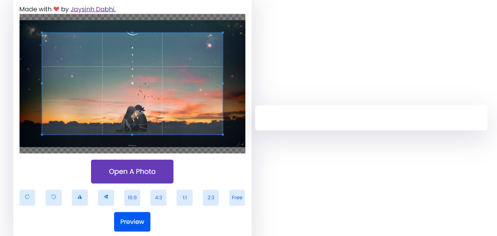
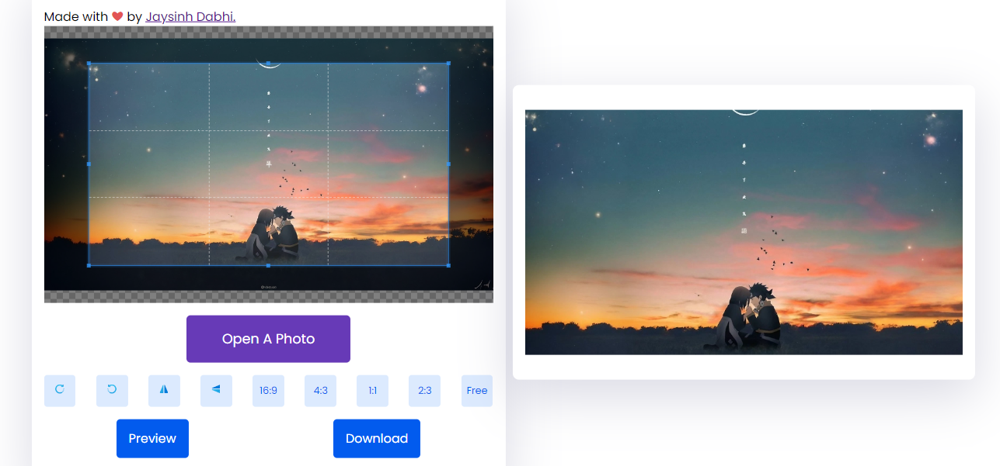

 

  

  <h3 align="center">LightCrop</h3>

  

    Fast and Simple Image Cropper
     
     
    <a href="https://github.com/JaysinhDabhi/https://github.com/JaysinhDabhi/">View Demo</a>
    .
    <a href="https://github.com/JaysinhDabhi/https://github.com/JaysinhDabhi//issues">Report Bug</a>
    .
    <a href="https://github.com/JaysinhDabhi/https://github.com/JaysinhDabhi//issues">Request Feature</a>
  

## About The Project

**LightCrop** is a minimalist online image editor built with HTML, CSS, and JavaScript. It allows users to effortlessly crop images in three popular aspect ratios (1:1, 16:9, and 4:5) with a live preview and download option. Designed for speed and simplicity, LightCrop offers a lightweight and user-friendly experience.

## Built With

**Front-end:** HTML, CSS, JavaScript  
**Libraries (optional):** Consider using lightweight libraries like FileReader, FilePond, or cropper.js for easier file handling and cropping functionality.

## Usage

Develop a user-friendly and intuitive interface for image cropping.
Ensure smooth responsiveness and fast loading times.
Maintain a small codebase for ease of maintenance and future updates. 

## Demo

<a href="https://github.com/JaysinhDabhi/https://github.com/JaysinhDabhi/">View Demo</a>

## Authors

* **Jaysinh Dabhi** - Full Stack Developer - [Jaysinh Dabhi](https://github.com/JaysinhDabhi/) - Built LightCrop!

